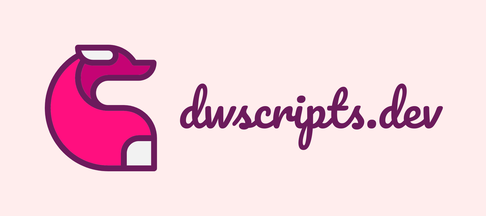

<div align="center">



<h1>📦 dw-releases</h1>

**Public project index for all dw-scripts packages.**

Each project has its own subfolder containing a description page and a version file,  
kept up-to-date automatically via GitHub Actions on every version bump.

[](https://github.com/ipatavatsizz/dw-releases)
[](https://github.com/ipatavatsizz/dw-releases)

</div>

---

## 🗂️ Projects

| Project                   | Current Version                       | Description                                                  |
| :------------------------ | :------------------------------------ | :----------------------------------------------------------- |
| [`dw-phone`](./dw-phone/) | See [`.version`](./dw-phone/.version) | Modern, pixel-perfect FiveM phone with full iOS-inspired UI. |

---

## 📁 Repository Structure

Each project folder contains three things and nothing more:

```text
dw-releases/
├── dw-phone/
│   ├── .version        # Plain-text version string (e.g. 26.2.0-alpha)
│   ├── README.md       # Project description page (synced from source repo)
│   └── assets/         # Media referenced in the README
│
└── README.md           # ← You are here
```

### `.version`

A plain-text file containing only the current version string. Intended for programmatic version checks — no JSON parsing, no API rate limits, no authentication required.

```text
GET https://raw.githubusercontent.com/ipatavatsizz/dw-releases/main/dw-phone/.version
→ 26.2.0-alpha
```

### `README.md`

The project's public description page. Contains feature overview, screenshots, and any other information relevant to end users. This file is a mirror of the source repository's `README.md`, kept in sync automatically.

---

## ⚙️ How Sync Works

This repository is never edited manually. Each private source repository runs a GitHub Actions workflow that detects a version bump in `package.json` and pushes updated files here.

```text
Source repo (private) ──► version bump on main ──► GitHub Actions ──► dw-releases/<project>/
```

A reusable workflow template is included at [`deploy-public.yml.example`](./deploy-public.yml.example) for onboarding new projects.

---

<div align="center">
  <sub>Maintained by <a href="https://github.com/ipatavatsizz">dw-scripts</a> · All updates are automated · Do not edit project subfolders manually</sub>
</div>
