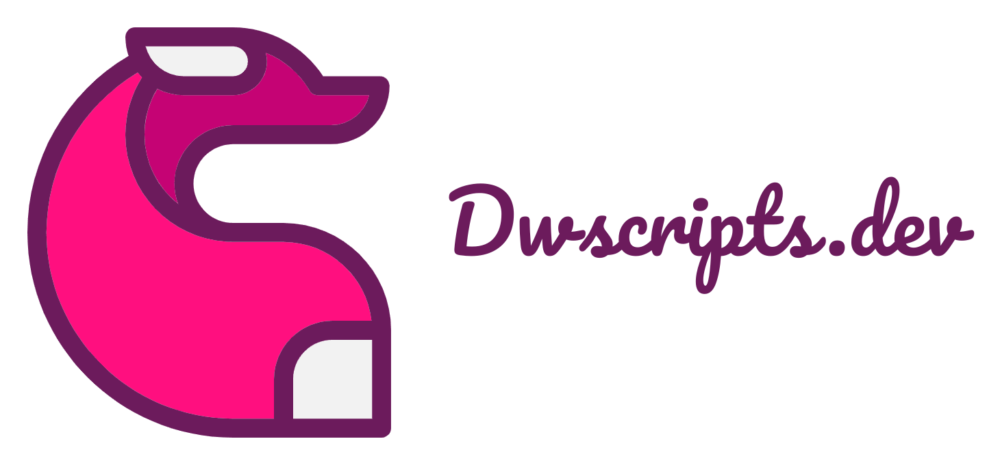
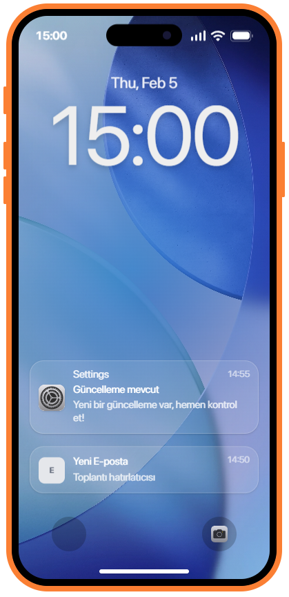

<div align="center">
  <a href="https://phone.dwscripts.dev">
    
  </a>

  <br />
  <br />

  <h1>Modern Phone for FiveM</h1>

  <p>
    <b>High Performance</b> • <b>Pixel Perfect</b> • <b>Developer Friendly</b>
  </p>

  <div align="center">
    <!-- Tech Stack Badges -->
    
    
    
    
    <br/>
    
    
    
  </div>
</div>

<br />

---

## 🔥 Key Features

| 🍎 **Modern Interface**                                                                     | ⚡ **Blazing Fast**                                                               | 🛠️ **Developer First**                                                                  |
| :------------------------------------------------------------------------------------------ | :-------------------------------------------------------------------------------- | :-------------------------------------------------------------------------------------- |
| Pixel-perfect animations, blur effects, and fluid gestures mimicking real high-end devices. | Optimized `0.01ms` idle usage. React 19 & Vite ensure instant NUI response times. | Written in TypeScript. Full mock mode for browser development without restarting FiveM. |

| 🔄 **Auto Sync**                                                                       | 🎮 **Game Integration**                                                            | 🧩 **Modular Apps**                                                              |
| :------------------------------------------------------------------------------------- | :--------------------------------------------------------------------------------- | :------------------------------------------------------------------------------- |
| Real-time session synchronization with MySQL database. Never lose settings on restart. | Physical prop animation, sprint-while-using support, and camera locking mechanism. | Apps are auto-discovered via filesystem. Just drop a folder to create a new app. |

---

## 📸 Screenshots

<div align="center">
  <table>
    <tr>
      <td align="center"><b>Lock Screen</b></td>
      <td align="center"><b>Setup Wizard</b></td>
      <td align="center"><b>Settings App</b></td>
    </tr>
    <tr>
      <td></td>
      <td></td>
      <td></td>
    </tr>
  </table>
</div>

---

## 🚀 Getting Started

### Prerequisites

- Node.js 20+
- pnpm (`npm i -g pnpm`)
- FiveM Server (Optional for browser dev)

### 💻 Development Workflow (Recommended)

Work strictly in the browser. It mocks all FiveM natives and data.

```bash
# 1. Install dependencies
pnpm install

# 2. Start the dev server
pnpm --filter @dw/phone dev
```

> Open `http://localhost:5173` to start coding.

### 🎮 Deploy to FiveM

When you are ready to test in-game:

1.  Create a `.env` file in root (copy `.env.example`).
2.  Set `DW_OUTDIR` to your server's resource folder.
3.  Run:

```bash
pnpm run build:all
```

---

## 📦 Project Structure

We use a **monorepo** architecture to separate concerns.

<details>
<summary><b>Click to expand folder structure</b></summary>

| Path             | Description                                                                                |
| :--------------- | :----------------------------------------------------------------------------------------- |
| `packages/core`  | **Shared Logic:** Type definitions, Zod schemas, event constants used by both Client & UI. |
| `packages/phone` | **The Frontend:** React + Vite application. Contains all apps, stores, and hooks.          |
| `packages/fivem` | **The Bridge:** Lua/TS Runtime. Handles NUI focus, database sync, props, and animations.   |

</details>

---

## ✅ Feature Status

### 📱 Applications

- [x] **Settings:** Wi-Fi, Bluetooth, Wallpaper, Ringtone, Display.
- [x] **Contacts:** Create, Edit, Delete (Local & Synced).
- [ ] **Messages:** Chat UI (WIP).
- [ ] **Camera:** Photo taking (WIP).
- [ ] **Bank:** Transactions history (Stub).

### ⚙️ System

- [x] **Dynamic Island:** Notification & Status indicators.
- [x] **Setup Wizard:** First-time user experience.
- [x] **Notifications:** System-wide push notifications.
- [x] **Status Bar:** Battery, Signal, Time.

---

## 🤝 Contributing

This is a private project.

<div align="center">
  <sub>Built with ❤️ by dw-scripts</sub>
</div>
