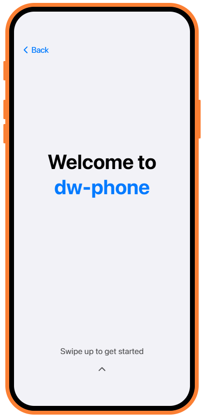
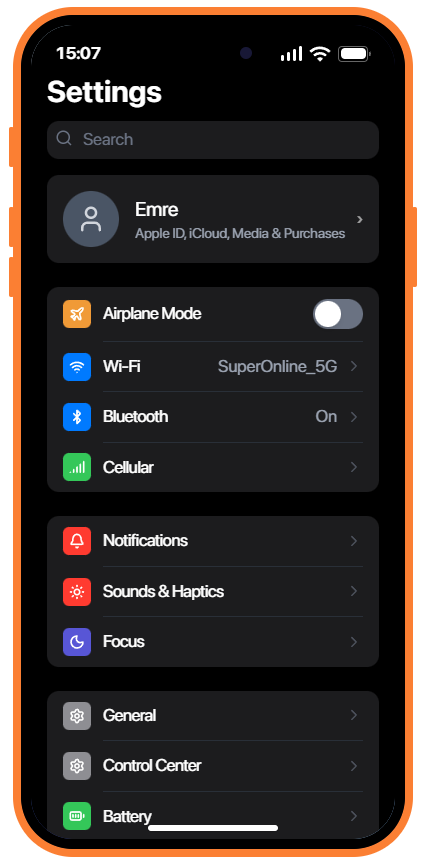

  

   
   

  <h1>DW Phone</h1>

  

    A high-fidelity phone system built with one goal in mind:
    to become the best phone experience available for FiveM.
  

  

    <b>React 19</b> • <b>TypeScript</b> • <b>FiveM Native Integration</b> • <b>Developer-Friendly Monorepo</b>
  

  

    
    
    
    
  

  

    
    
    
  

---

## Why DW Phone?

Most FiveM phone resources either look modern or behave like a real system. DW Phone is built to do both.

It combines a polished mobile UI, real client/server contracts, and gameplay-facing systems such as calling, messaging, camera capture, notifications, persistent session state, and deeper in-world interaction flow.

The goal is not to ship "just another phone script." The goal is to build a phone that feels premium in the player's hand, reliable under real server usage, and strong enough to stand as the benchmark for what a FiveM phone can be.

---

## What You Get

- A premium-feeling phone UI with smooth transitions, overlays, notifications, lock screen, recent apps, and Dynamic Island behavior.
- Real app flows for Contacts, Messages, Camera, Gallery, Settings, App Store, and Phone interactions.
- End-to-end call flow with `pma-voice` integration.
- Server-backed messaging with conversations, participants, unread state, and live delivery.
- Camera pipeline with in-game screenshot upload and gallery persistence.
- Shared `core` contracts between frontend, FiveM client, and FiveM server.
- A monorepo structure that keeps product code, bridge code, and shared types separated cleanly.
- Browser mock support for fast UI iteration during development.

---

## Highlights

| Area              | What it means in practice                                                                                  |
| :---------------- | :--------------------------------------------------------------------------------------------------------- |
| UI quality        | Smooth animations, modern layouts, blur, overlays, lock screen, status bar, and responsive app transitions |
| Real systems      | Calls, messages, notifications, camera capture, gallery persistence, and phone session sync                |
| FiveM integration | Physical phone behavior, NUI bridge, server sync, camera flow, and voice channel handling                  |
| Extensibility     | Shared types, modular app manifests, and cleaner routing/deep-link infrastructure                          |
| Development       | Fast browser-side iteration with a codebase designed to scale into a larger product                        |

---

## Screenshots

  <table>
    <tr>
      <td align="center"><b>Lock Screen</b></td>
      <td align="center"><b>Setup Wizard</b></td>
      <td align="center"><b>Settings</b></td>
    </tr>
    <tr>
      <td></td>
      <td></td>
      <td></td>
    </tr>
  </table>

---

## Architecture

DW Phone is organized as a workspace monorepo with clear responsibility boundaries.

| Path             | Responsibility                                                                                          |
| :--------------- | :------------------------------------------------------------------------------------------------------ |
| `core/`          | Shared event names, RPC contracts, app types, domain models, and common types used across the stack     |
| `phone/`         | React/Vite frontend, app UIs, state stores, routing, overlays, theming, and browser mock support        |
| `fivem/`         | FiveM bridge layer, NUI callbacks, client/server runtime code, DB integration, and game-facing behavior |
| `release-notes/` | Local release note copies used during development                                                       |
| `scripts/`       | Root build and watch orchestration for bundling the full resource                                       |

This separation is one of the main reasons the project stays workable as features grow.

---

## Requirements

- Node.js 22+
- `pnpm`
- A FiveM server for in-game testing
- `oxmysql` on the server side
- `pma-voice` for call channel handling
- `screencapture` for in-game photo capture uploads

---

## Current Product Scope

Already present in the project today:

- Contacts management
- Calling flow with active, incoming, and outgoing call UI
- Messaging flow with conversations and live updates
- Camera app and gallery persistence flow
- Settings app and system preferences
- Dynamic Island and system overlays
- Lock screen and setup flow
- Notification system and deep-link-driven app opening
- Supporting browser mock mode for frontend development

Still evolving:

- broader app ecosystem
- additional system integrations
- further polish on media, economy, and extensibility

The long-term direction is simple: tighter gameplay integration, stronger app ecosystems, and a phone that feels less like an overlay and more like a real in-game device.

---

## Release Notes

Release notes and developer logs are maintained in the dedicated `dw-releases` repository under the `dw-phone/release-notes` section.

---

## Notes

- This is a private project.
- Browser support exists to improve development speed, not to define the product's identity.
- The real north star is building the most complete, polished, and convincing phone experience possible for FiveM.
- The resource currently targets a modern stack and expects a reasonably up-to-date FiveM server environment.

---

  Built by dw-scripts

